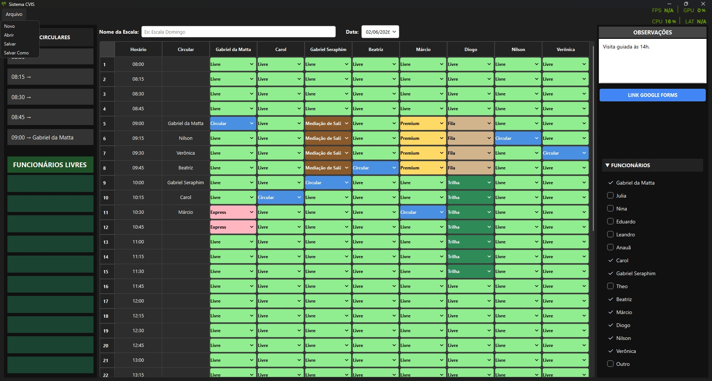
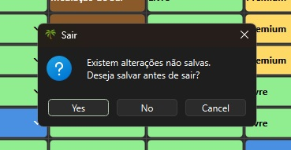

# Sistema CVIS

  

Aplicação desktop desenvolvida em Python e PySide6 para gerenciamento de escalas operacionais e controle de serviços e acompanhento de funcionários.

## Funcionalidades

- Controle de circulares
- Escala por horário
- Painel de funcionários livres
- Observações operacionais
- Salvamento e abertura de escalas
- Interface gráfica em PySide6
- Geração de executável Windows

## Tecnologias

- Python
- PySide6
- JSON
- PyInstaller

## Capturas de tela

## Autor

Gabriel da Matta

## Status do Projeto

Versão 1.0

Projeto desenvolvido para gerenciamento de escalas operacionais.

O desenvolvimento foi encerrado após a primeira versão funcional.

Possíveis melhorias futuras:

- Integração com banco de dados
- Sincronização em rede local ou Google Drive
- Cadastro dinâmico de funcionários
- Atualização em tempo real entre múltiplos computadores
